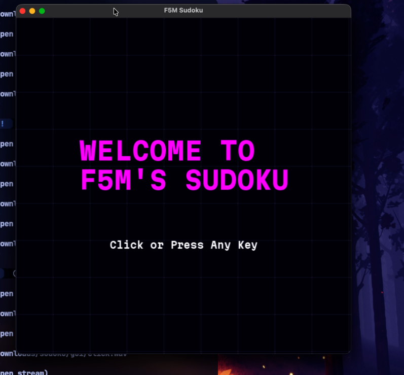
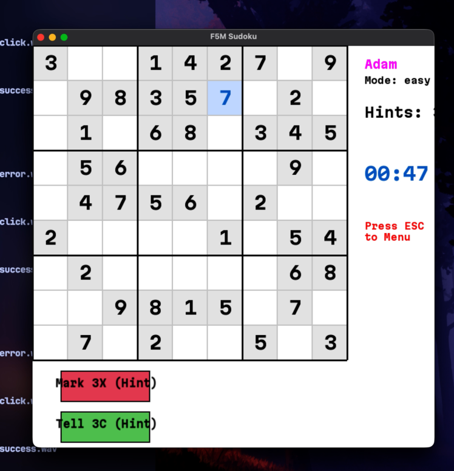
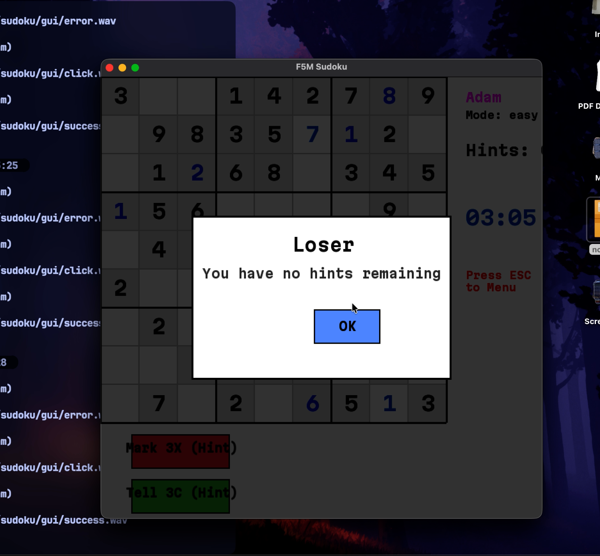

A rather simple and lacking implementation of sudoku made in c++ by a friend and me in c++ for our uni's freshman project. It's not really optimized because we couldn't use any real libraries or data structures but it was fun to make.

### Screenshots

### Known issues 
None I am perfect (except some minor visual errors. ie the hints button being too small for their texts)
